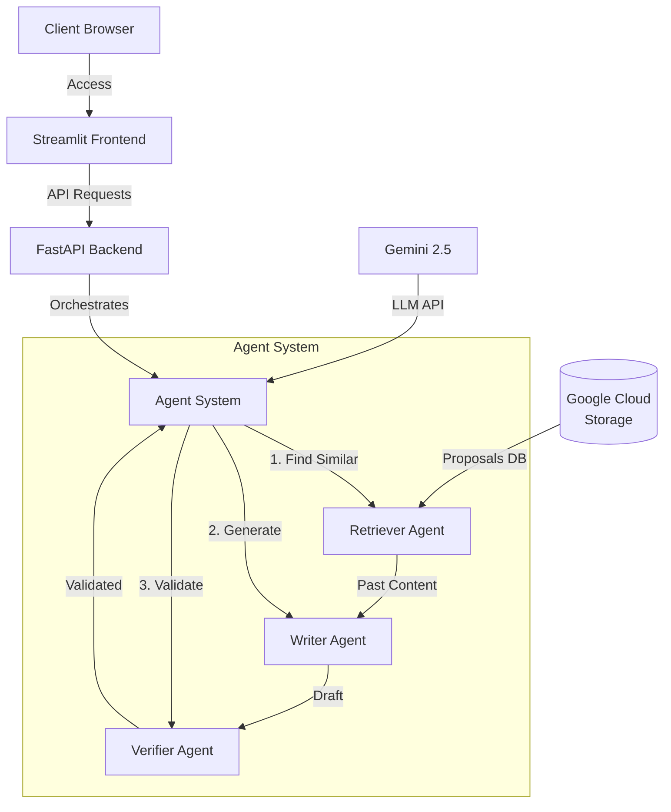

# ProPulse: Enterprise Proposal Assistant

ProPulse is a multi-agent system that automates enterprise proposal generation using Google's Gemini 1.5 and ADK. The system leverages specialized AI agents to retrieve relevant past work, generate custom proposals, and validate content accuracy.

## 🏗️ Architecture



## 🤖 Agent Collaboration

1. **Retriever Agent**
   - Analyzes incoming RFP requirements
   - Searches historical proposals
   - Extracts relevant sections and insights

2. **Writer Agent**
   - Uses retrieved content as context
   - Generates new proposal sections
   - Adapts tone using defined personas

3. **Verifier Agent**
   - Validates technical accuracy
   - Ensures compliance with RFP
   - Checks for consistency

## 🚀 Setup Instructions

### Prerequisites
- Python 3.9+
- Google Cloud account
- Gemini API access

### Local Development
1. Clone the repository:
   ```bash
   git clone https://github.com/your-org/enterprise-proposal-assistant.git
   cd enterprise-proposal-assistant
   ```

2. Create and activate virtual environment:
   ```bash
   python -m venv venv
   source venv/bin/activate  # Linux/Mac
   # or
   .\venv\Scripts\activate  # Windows
   ```

3. Install dependencies:
   ```bash
   pip install -r requirements.txt
   ```

4. Set up environment variables:
   ```bash
   cp .env.sample .env
   # Edit .env with your credentials
   ```

5. Start services:
   ```bash
   # Terminal 1: Backend
   cd backend
   uvicorn main:app --reload --port 8000

   # Terminal 2: Frontend
   cd frontend
   streamlit run main.py
   ```

### Cloud Deployment
1. Set up Google Cloud project
2. Configure Cloud Run
3. Deploy using provided scripts in `infra/gcp/`

## 📁 Project Structure

```
enterprise-proposal-assistant/
├── backend/         # FastAPI + Google ADK agents
├── frontend/        # Streamlit UI
├── shared/          # Common assets and schemas
├── infra/          # Deployment configurations
└── .github/        # CI/CD workflows
```

## 🔑 Environment Variables

Required environment variables:
- `GEMINI_API_KEY`: Google Gemini API key
- `BACKEND_URL`: FastAPI backend URL
- `GCP_PROJECT_ID`: Google Cloud project ID
- `STORAGE_BUCKET`: GCS bucket for proposals

## 📚 Documentation

- [Backend Documentation](./backend/README.md)
- [Frontend Documentation](./frontend/README.md)
- [Infrastructure Guide](./infra/README.md)

## 📝 License

MIT License - see LICENSE file for details # Propulse
